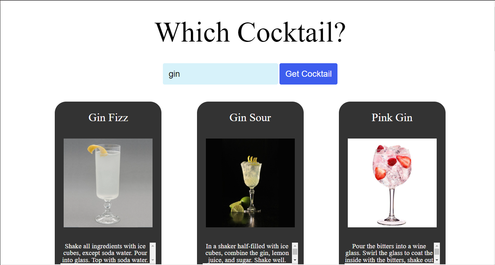

# CocktailDB Site
Application to take in a user inputed adult beverage and return the image, name, and instructions on how to make it.

**Link to project:** [https://richernote.github.io/CocktailDB/]

## How It's Made:

**Tech used:** 

  
  
  

## Optimizations

-If search returns multiple drinks, app cycles through them all.

-Added new branch to show all results in their own elements.

## Lessons Learned:

How to make fetch data from an API and how to parse through the returned data